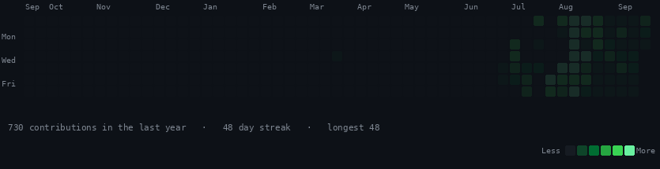
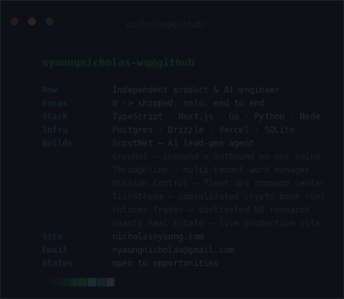

<div align="center">

<h3><code>nicholas@github ~ $ ./contributions.sh</code></h3>



<br><br>

<h3><code>nicholas@github ~ $ whoami</code></h3>



</div>

---

# Hi, I'm Nicholas 👋

**Independent product & AI engineer.** I take ideas from zero to shipped — solo, end to end: web apps, AI agents, trading systems, even a book. I build fast with AI-assisted engineering, and I build in the open.

🌐 **[nicholasnyaung.com](https://nicholasnyaung.com)** · ✉️ nyaungnicholas@gmail.com

---

### 🛠️ Selected work

**Growth & go-to-market**
- 🎯 **[ScoutNet](https://github.com/nyaungnicholas-wq/scoutnet)** — an AI lead-gen agent: finds local businesses whose marketing is quietly costing them customers, scores each on transparent evidence, and drafts an honest cold email sent from your own domain. Zero-config local run, one-click deploy. *Next.js 16 · Drizzle · Postgres.*
- 📥 **[LeadNet](https://github.com/nyaungnicholas-wq/leadnet)** · 📤 **[ReachNet](https://github.com/nyaungnicholas-wq/reachnet)** · 🔗 **[GrowNet](https://github.com/nyaungnicholas-wq/grownet)** — inbound capture, outbound email, and the unified platform that merges both onto one contact spine. *Next.js · Drizzle · PGlite.*

**Products & tools**
- 🗂️ **[Throughline](https://github.com/nyaungnicholas-wq/throughline)** — multi-tenant work manager built around delegation: assign, track, approve. Kanban / Table / Calendar / Gantt, plus AI board generation. *Next.js 16 · Drizzle.*
- 🛰️ **[Mission Control](https://github.com/nyaungnicholas-wq/mission-control)** — local command center for a whole fleet of projects: health probes (git / uptime / build / cron), live telemetry, and read-only auditing agents that hunt bugs and security issues. *Next.js · Node daemon · SQLite · SSE.*
- 💸 **[CreatorLedger](https://nyaungnicholas-wq.github.io/creatorledger/)** — free tax & true-profit calculator for creators across YouTube, Twitch, Patreon and TikTok.
- 🧾 **[1042-S Organizer](https://github.com/nyaungnicholas-wq/1042s-organizer)** — Acrobat JavaScript that splits a multi-recipient IRS Form 1042-S PDF by recipient, reorders interleaved instruction pages, self-verifies, and writes one clean PDF per person.

**Systems & markets**
- ⚡ **[TickStream](https://github.com/nyaungnicholas-wq/tickstream)** — consolidated crypto order book in Go: Coinbase + Kraken L2 feeds merged into one BBO, wait-free read path, honestly measured apply latency.
- 📈 **[Futures Trader](https://github.com/nyaungnicholas-wq/futures-trader)** — backtested NQ strategy research, trend + mean-reversion sleeves, validated across market regimes. *Python. Research only — no live trading.*

**Sites**
- 🏡 **[Shanty Real Estate](https://shanty-realestate.com)** — live in production for a working agent. Motion-heavy *Next.js 16 · Framer Motion · Lenis.*
- 🎨 **[nyaung-studio](https://nicholasnyaung.com)** — my studio site. Custom WebGL/GLSL shader, *Three.js · GSAP.*

---

### ⚙️ How I work
Idea → deployed product, solo, at studio speed. I care about shipping real things people can click, honest scope, and claims I can back with evidence.

### 🧰 Stack
`TypeScript` `Next.js / React` `Go` `Python` `Node` `Tailwind` `Postgres` `Drizzle` `Vercel`

---

*Currently open to opportunities — reach me at nyaungnicholas@gmail.com.*

<details>
<summary>How the art at the top is made</summary>

Both GIFs are generated by the scripts in [`scripts/`](./scripts) and committed to this repo — nothing renders on a third-party server, so nothing can rate-limit or 404 into a broken-image icon.

| Script | Output |
|---|---|
| `fetch_contributions.py` | scrapes the public `github.com/users/<user>/contributions` HTML (no token needed) → `data/contributions.json` |
| `make_gifs.py` | draws both animations frame by frame with Pillow → `contrib-heatmap.gif`, `info-card.gif` |
| `check_gifs.py` | self-test: real GIF, animated, right size, ends fully drawn, plays once, under 400 KB |

**Why GIF and not animated SVG.** GitHub embeds README images as `` and runs neither CSS `@keyframes` nor SMIL `<animate>` in that context — an SVG reveal starting at `opacity:0` renders a permanently blank box. GIF frames don't depend on the renderer animating anything, so the art is correct either way: each animation is a fade-up that starts at 22% brightness, so frame 0 is already legible for anything that won't animate, and neither GIF carries a loop extension — they play once and rest on the final, fully-drawn frame.

The heatmap refreshes daily via [`.github/workflows/update-profile-art.yml`](./.github/workflows/update-profile-art.yml).

```bash
pip install -r scripts/requirements.txt
python scripts/fetch_contributions.py && python scripts/make_gifs.py
```

</details>
